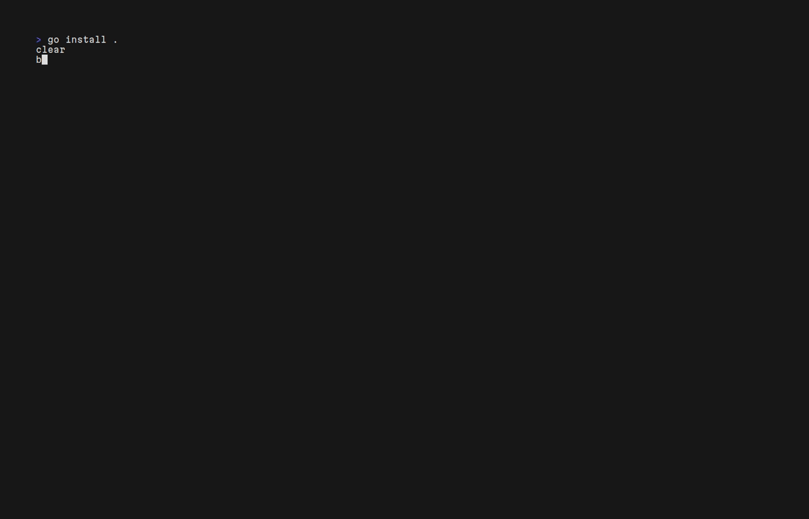

# Batter Up!

Monitor MLB games from your terminal. 



Shoutouts to [Playball](https://github.com/paaatrick/playball) for the great program that this is definitely derivative[^1] of. Give it a peek as well!

## Installation

### Homebrew 🍺 

- Have `brew` installed ([brew.sh](https://brew.sh))
- Run the following:
```sh
brew install --cask daltonsw/tap/batterup
```

### Go 🖥️ 

- Have `Go` 
- Have your `Go` install location on your `$PATH`
- Run the following: 
```sh
go install go.dalton.dog/batterup@latest
```

### Github Releases 🐙

- Go to the `Releases` tab of the repo [here](https://github.com/DaltonSW/batterup/releases)
- Download the latest archive for your OS/architecture
- Extract it and place the resulting binary on your `$PATH` and ensure it is executable

```sh
cd ~/Downloads # Assuming you downloaded it here
tar -xvf batterup_[whatever].tar.gz # x: Extract; v: Verbose output; f: Specify filename
chmod +x batterup # Make file executable
mv batterup [somewhere on your $PATH] # Move the file to somewhere on your path for easy execution
```


## Usage

All functionality is available by running the `batterup` program directly

## Footnotes

[^1]: This project is essentially a fork, but it felt strange to fork a repo and then just delete everything from it as the first step. I am a JavaScript Disliker, so contributing back also didn't make much sense. Rewriting/migrating it to Go sounded like a fun project, so here we are.

